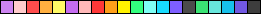

## Flat Color Palettes for Unity

This repository contains a number of color palette assets for Unity. These palettes must be put inside *Assets/Editor* folder in your project (if *Editor* doesn't exist, create it manually). To activate a color palette, simply open the color picker, hit the button next to **Presets** and select the desired palette.

## Credits

- **MaterialUiColors:** http://materialuicolors.co/
- **All other palettes:** https://flatuicolors.com/

## Previews

- American

- Aussie

- British

- Canadian

- Chinese

- Dutch

- FlatUiPaletteV1

- French

- German

- Indian

- MaterialUiColors

- Russian

- Spanish

- Swedish

- Turkish

